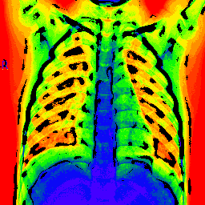
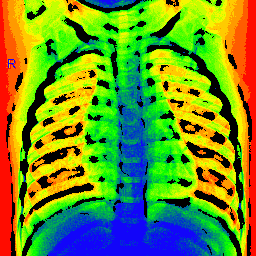

# Radiant X-Ray: A Small Dataset of Processed Chest X-Ray Images

This dataset is used as part of a tutorial on Deep Generative Neural Networks by Amir Atapour-Abarghouei.

The images in this dataset have been downloaded and subsequently processed and do not belong to the author of this repository. As such, they can only be used for academic and research purposes.

---

## Content:

This dataset is made up of 1000 sample images of chest x-ray images. False colour has been added to images for easier visualisation and all images have been filtered and posterised.

Example of the images can be seen in the following:

The images were originally part of "Chest X-Ray Images (Pneumonia)" dataset:

https://www.kaggle.com/datasets/paultimothymooney/chest-xray-pneumonia
---